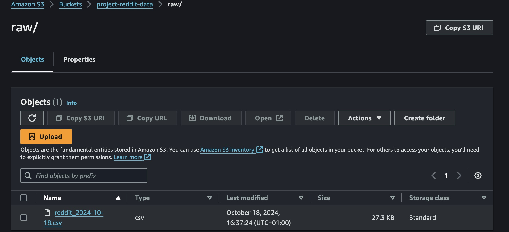
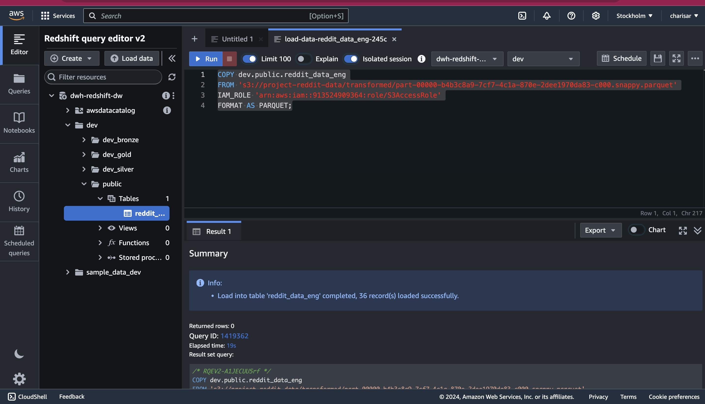

# Reddit Data Analytics Pipeline

## Overview
An end-to-end data engineering implementation using AWS services to process and analyze Reddit data. The pipeline ingests data from Reddit, processes it using Apache Airflow for orchestration, and leverages various AWS services for storage, transformation, and analysis.

## Architecture


The architecture implements a complete data pipeline that:
- Ingests data from Reddit API
- Uses Apache Airflow for workflow orchestration
- Processes data through AWS services including Glue and Redshift
- Makes data accessible via Amazon Athena
- Enables visualization through BI tools (QuickSight, Tableau, Looker Studio)

## Prerequisites
- Docker and Docker Compose
- AWS Account with appropriate permissions
- Reddit API credentials
- Python 3.9+

## AWS IAM Setup
Create an IAM user with permissions for the following services:

1. **S3 Permissions**
   - ListBucket
   - PutObject
   - GetObject
   - DeleteObject

2. **Redshift Permissions**
   - GetClusterCredentials
   - ExecuteStatement
   - DescribeStatement
   - GetStatementResult

3. **AWS Glue Permissions**
   - GetDatabase/GetDatabases
   - GetTable/GetTables
   - GetPartitions
   - GetUserDefinedFunctions

4. **IAM Permissions**
   - PassRole

Ensure these permissions are configured with appropriate resource restrictions based on your security requirements.

## Project Structure
```
.
├── config/                 # Airflow configuration files
├── dags/                  # DAG files
├── data/                  # Data storage
├── etls/                  # ETL scripts
├── logs/                  # Log files
├── pipelines/             # Pipeline definitions
├── plugins/               # Airflow plugins
├── tests/                 # Test files
├── utils/                 # Utility scripts
├── Dockerfile            
├── docker-compose.yml    
└── requirements.txt      
```

## Docker Setup
The pipeline uses a custom Airflow image built with Python 3.9. The Docker Compose configuration includes:
- PostgreSQL database for Airflow metadata
- Redis for message brokering
- Airflow services (webserver, scheduler, worker)

### Services Configuration
1. **PostgreSQL Database**
   - Stores Airflow metadata
   - Maintains task history
   - Tracks DAG states

2. **Redis Message Broker**
   - Handles message queuing
   - Manages task distribution
   - Coordinates workers

3. **Airflow Services**
   - Webserver (UI access)
   - Scheduler (DAG monitoring)
   - Worker (Task execution)

## Installation & Setup

1. Clone the repository:
```bash
git clone [repository-url]
cd reddit-data-pipeline
```

2. Configure environment variables:
   - Create `airflow.env` file with necessary configurations
   - Set Reddit API credentials
   - Configure AWS credentials

3. Build and start the services:
```bash
docker-compose up -d --build
```

4. Access Airflow UI:
   - URL: `http://localhost:8081`
   - Default credentials:
     - Username: admin
     - Password: admin

## Data Pipeline

### Data Flow
1. **Ingestion**
   - Reddit data is extracted via API
   - Raw data is stored in S3
   

2. **Transformation**
   - AWS Glue processes raw data
   - Transformed data is loaded into Redshift
   

### Key Components

- [AWS ETL Script](./etls/aws_etl.py)
- [Reddit ETL Script](./etls/reddit_etl.py)
- [DAG Definition](./dags/reddit_dag.py)
- [Pipeline Configurations](./pipelines/)

## Monitoring & Maintenance

- Monitor DAG runs through Airflow UI
- Check logs in `/logs` directory
- Monitor AWS services through AWS Console

## Acknowledgments

Special thanks to [Yusuf Ganiyu](@CodeWithYu) whose comprehensive tutorial and guidance made this project possible. His detailed video tutorials on data engineering with AWS services were instrumental in the successful execution of this project.
